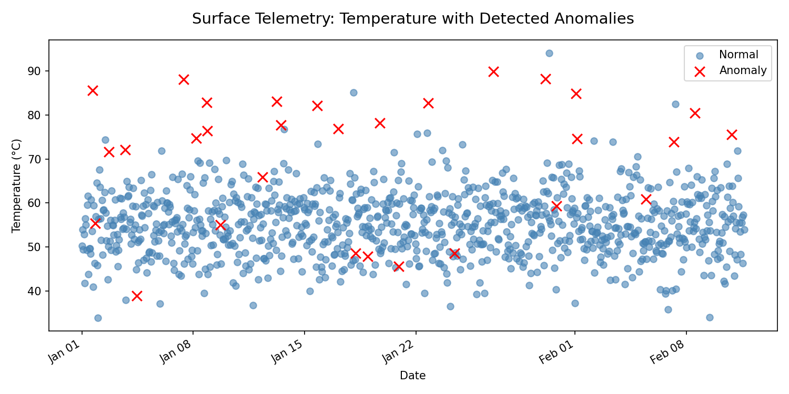

# Surface Telemetry Analysis

This project demonstrates how device telemetry (CPU, memory, temperature, fan RPM, battery wear, and error logs) can be analyzed to **detect anomalies** and **forecast device errors**.

The analysis is based on **synthetic data** designed to mimic real-world Surface device behavior.

---

## Project Steps
1. Generate synthetic telemetry dataset  
2. Explore trends and visualize metrics  
3. Detect anomalies (thermal spikes, error bursts) using **Isolation Forest**  
4. Forecast next-hour error rates with **Gradient Boosting**  
5. Translate results into **product team recommendations**

---

## Why It Matters
For hardware and software teams, telemetry helps answer:  
- When are devices running outside safe bounds?  
- Can we predict failures before they impact users?  
- Which components (CPU, battery, fan) contribute most to errors?  

By detecting anomalies early and forecasting error spikes, product teams can take action to improve **reliability, thermal management, and customer experience**.

---

## Repository Contents
- `surface.ipynb` → Colab notebook with full analysis and plots  
- `surface.pdf` → Exported notebook (print-ready for review)  
- `anomaly_plot.png` → Sample visualization used in this README  

---

## Sample Output
Here’s an example anomaly detection plot, showing device temperature over time.  
- **Blue = normal behavior**  
- **Red X = anomaly (thermal spike / error burst)**  

---

## How to Run
1. Clone this repo and open `surface.ipynb` in Google Colab.  
2. Run all cells (dependencies: `numpy`, `pandas`, `matplotlib`, `scikit-learn`).  
3. Export to PDF for sharing.  

---

**Note:** All data is synthetic and for demonstration purposes only.
